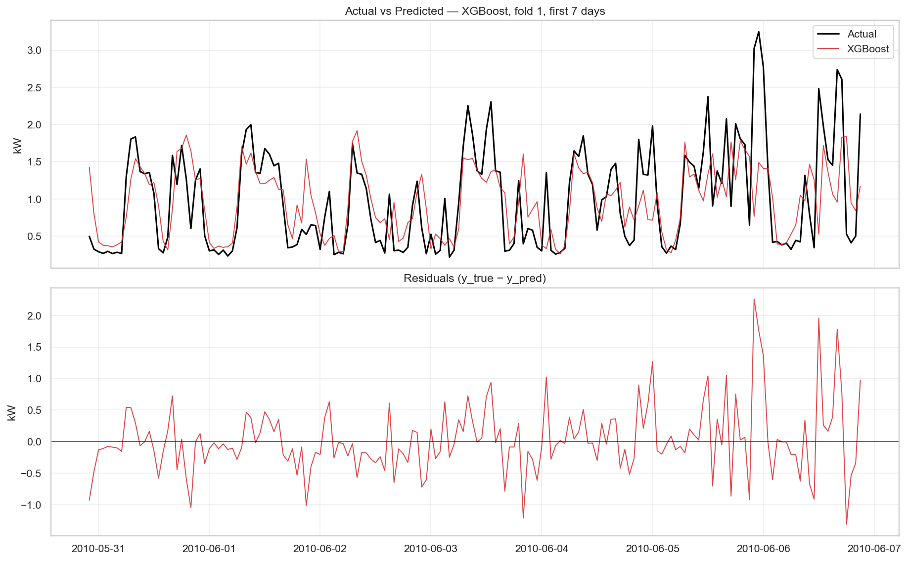

---
title: "Leakage-Safe Household Energy Forecasting"
subtitle: "LUISS AI Techniques Project Work"
author: "Thierry Ishimwe"
date: "May 2026"
format:
  pdf:
    documentclass: article
    geometry: margin=0.65in
    fontsize: 10pt
    number-sections: false
execute:
  echo: false
  warning: false
  message: false
---

```{python}
import pandas as pd
from pathlib import Path

ROOT = Path('../..').resolve()
results = ROOT / 'reports' / 'results'
figures = ROOT / 'reports' / 'figures'
leaderboard = pd.read_csv(results / 'leaderboard_phase4.csv')
xgb_folds = pd.read_csv(results / 'xgboost_fold_results.csv')
```

## Objective and Dataset

The project brief asks for a time-series forecasting model for electricity consumption using the UCI Individual Household Electric Power Consumption dataset, plus EDA, at least two model families among classical statistical and deep learning methods, and evaluation with MAE and RMSE. The source data contains 2,075,259 minute-level measurements from one household in Sceaux, France, from December 2006 through November 2010. The rebuilt pipeline forecasts hourly mean `Global_active_power` in kW.

The central modeling correction was leakage control. The inherited modeling work used same-timestamp `Voltage`, `Global_intensity`, and `Sub_metering_1/2/3` as predictors. Those variables are contemporaneous physical measurements or components of the target, so they reconstruct power rather than forecast it. The rebuilt feature registry marks those columns unsafe and the feature pipeline refuses to emit them in strict mode.

## EDA Summary

The EDA found strong daily and weekly seasonality, a right-skewed load distribution, and meaningful missingness structure. There are 25,979 rows with missing values across 71 gaps; the longest gap contains 7,226 consecutive minute rows during August 2010. Short gaps are interpolated, while long outage gaps are preserved and flagged before hourly aggregation.

These findings shaped the final feature set: calendar features, cyclical encodings, French holiday flags, target lags at 1, 24, and 168 hours, and rolling statistics over 3, 24, and 168 hours. All lag and rolling features use past-only values.

## Methodology

Validation uses six rolling-origin folds. Each fold trains on 365 days and validates on the following 30 days. Metrics are computed on the validation windows using MAE, RMSE, WAPE, sMAPE, and MASE. The primary comparison uses a one-step-ahead protocol so each prediction can use actual observations up to the previous hour, matching the operational information available to a forecaster.

Models evaluated were three naive lag baselines, SARIMA(1,1,1)x(1,1,1,24), XGBoost, LSTM, and GRU. XGBoost uses the full leakage-safe tabular feature matrix. LSTM and GRU are univariate sequence models with a 168-hour lookback, 64 hidden units, one recurrent layer, Adam optimization, and 25 epochs.

## Results

```{python}
cols = ['model', 'MAE_mean', 'RMSE_mean', 'MASE_mean']
leaderboard[cols].style.format({'MAE_mean': '{:.3f}', 'RMSE_mean': '{:.3f}', 'MASE_mean': '{:.3f}'})
```

XGBoost is the best single model with mean MAE 0.336 and RMSE 0.469. GRU follows closely at MAE 0.339, then LSTM at 0.343 and SARIMA at 0.345. The four real models sit within a narrow error band, while all beat the lag-1 persistence baseline at MAE 0.380.

```{python}
xgb_folds[['fold', 'valid_rows', 'MAE', 'RMSE']].style.format({'MAE': '{:.3f}', 'RMSE': '{:.3f}'})
```

Per-fold results show the seasonal difficulty pattern: August is easiest because the outage period reduces valid rows and average load, while October and November are hardest as consumption rises with colder weather.

{width=95%}

## Discussion and Conclusion

The realistic leakage-free MAE range is around 0.33-0.40 kW, not the inherited 0.0136 MAE produced by leaked contemporaneous variables. That correction is the most important technical result of the project. The final implementation satisfies the brief's modeling requirement with both a classical statistical model and deep learning models, and it also includes a stronger tabular model.

The next useful additions are a stacking ensemble over saved out-of-fold predictions, a Streamlit dashboard that loads the persisted XGBoost/LSTM/GRU models, and optional Prophet training for interpretability. These are extensions; the core brief-required forecasting comparison is complete.
